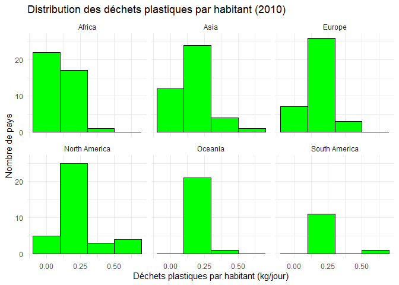

Lab 02 - Plastic waste
================
Votre nom
La date

## Chargement des packages et des données

``` r
library(tidyverse) 
```

``` r
plastic_waste <- read_csv("data/plastic-waste.csv")
```

Commençons par filtrer les données pour retirer le point représenté par
Trinité et Tobago (TTO) qui est un outlier.

``` r
plastic_waste <- plastic_waste %>%
  filter(plastic_waste_per_cap < 3.5)
```

## Exercices

``` r
plastic_waste %>%
  filter(plastic_waste_per_cap > 3.5)
```

    ## # A tibble: 0 × 10
    ## # ℹ 10 variables: code <chr>, entity <chr>, continent <chr>, year <dbl>,
    ## #   gdp_per_cap <dbl>, plastic_waste_per_cap <dbl>,
    ## #   mismanaged_plastic_waste_per_cap <dbl>, mismanaged_plastic_waste <dbl>,
    ## #   coastal_pop <dbl>, total_pop <dbl>

``` r
  ggplot(data = plastic_waste, aes(x = plastic_waste_per_cap)) +
  geom_histogram(binwidth = 0.2, fill = "green", color = "black") +
  labs(
    title = "Distribution des déchets plastiques par habitant (2010)",
    x = "Déchets plastiques par habitant (kg/jour ou tonne/an ?)",
    y = "Nombre de pays") +
  theme_minimal()
```

<!-- -->

### Exercise 1

``` r
ggplot(plastic_waste, aes(x = plastic_waste_per_cap)) +
  geom_histogram(binwidth = 0.2, fill = "green", color = "black") +
  facet_wrap(~ continent) +
  labs(
    title = "Distribution des déchets plastiques par habitant (2010)",
    x = "Déchets plastiques par habitant (kg/jour)",
    y = "Nombre de pays"
  ) +
  theme_minimal()
```

<!-- -->

### Exercise 2

``` r
library(ggplot2)

# Graphique de densité avec couleurs par continent
ggplot(plastic_waste, aes(x = plastic_waste_per_cap, fill = continent, color = continent)) +
  geom_density(alpha = 0.4) +
  labs(
    title = "Distribution des déchets plastiques par habitant (2010)",
    x = "Déchets plastiques par habitant (kg/jour)",
    y = "Densité"
  ) +
  theme_minimal()
```

<!-- -->

Dans ggplot, il faut différencier les esthétiques qui dépendent des
données (aes()) des paramètres fixes qui sont indépendants des données
(argument direct de la géométrie).Par exemple, la couleur (contour ou
remplissage) doit changer en fonction des variables, donc cela se fait
avec aes(). À l’inverse, la transparence est la même pour toutes les
courbes, donc cela se fait par geom_density().

### Exercise 3

Boxplot:

``` r
ggplot(plastic_waste, aes(x = continent, y = plastic_waste_per_cap)) +
  geom_boxplot(alpha = 0.6) +
  labs(
    title = "Déchets plastiques par habitant (2010)",
    x = "Continent",
    y = "Déchets plastiques par habitant (kg/jour)"
  ) +
  theme_minimal() +
  theme(legend.position = "none")
```

<!-- -->

Violin plot:

``` r
ggplot(plastic_waste, aes(x = continent, y = plastic_waste_per_cap)) +
  geom_violin(alpha = 0.6, trim = FALSE) +
  labs(
    title = "Déchets plastiques par habitant (2010)",
    x = "Continent",
    y = "Déchets plastiques par habitant (kg/jour)"
  ) +
  theme_minimal() +
  theme(legend.position = "none")
```

<!-- -->

Les Boxplot montrent la médiane, l’étendue interquartile et les
outliers, mais cela ils ne montrent pas la forme des distributions à
l’intérieur. Pour les Violoin plot, cela permet de voir la symétrie, les
différents pics et la concentration dans certaines zones.

### Exercise 4

``` r
# insert code here
```

Réponse à la question…

### Exercise 5

``` r
# insert code here
```

``` r
# insert code here
```

Réponse à la question…

## Conclusion

Recréez la visualisation:

``` r
# insert code here
```
